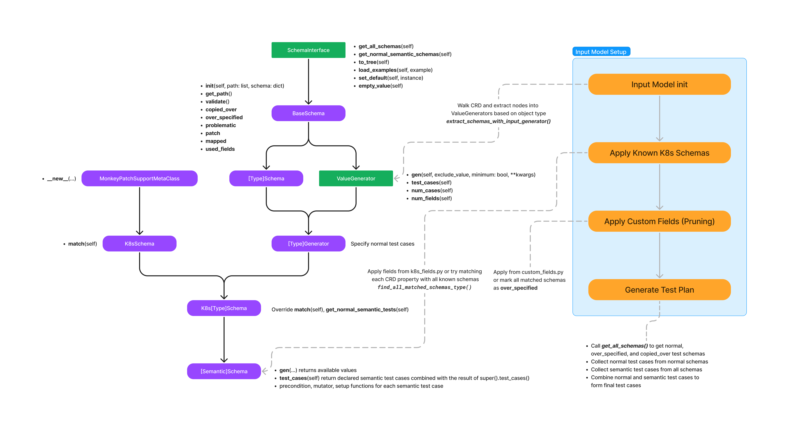

For example, to run Acto to test the cass-operator, just run
```sh
python3 -m acto --config data/cass-operator/config.json --num-workers 4 --workdir testrun-cass
```

## Interpreting the results produced by Acto

Acto will first generate a test plan using the operator's CRD and the semantic information. The test plan is serialized at `testrun-cass/testplan.json`. Note that Acto does not run the tests according to the order in the `testplan.json`, the tests are run in a random order at runtime.

Acto then constructs the number of Kubernetes clusters according to the `--num-workers` argument,
  and start to run tests.
Tests are run in parallel in separate Kubernetes clusters.
Under the `testrun-cass` directory, Acto creates directories `trial-XX-YYYY`. `XX` corresponds to the worker id, i.e. `XX` ranges from `0` to `3` if there are 4 workers.
`YYYY` starts from `0000`, and Acto increments `YYYY` every time it has to restart the cluster. This means every step inside the same `trial-xx-yyyy` directory run in the same instance of Kubernetes cluster.

Inside each `trial-*` directory, you can find the following files:
- `mutated-*.yaml`: These files are the inputs Acto submitted to Kubernetes to run the state transitions. Concretely, Acto first applies `mutated-0.yaml`, and wait for the system to converge, and then applies `mutated-1.yaml`, and so on.
- `system-state-*.json`: After each step submitting `mutated-*.yaml`, Acto collects the system state and store it as `system-state-*.json`. This file contains the serialized state objects from Kubernetes.
- `cli-output-*.log` and `operator-*.log`: These two files contain the command line result and operator log after submitting the input.
- `delta-*.log`: This file contains two parts. This file is for convenient debug purposes, it can be computed from `mutated-*.yaml` and `system-state-*.log`:
  - Input delta: The delta between current input and last input
  - System delta: The delta between current system state and last system state
- `events-*.log`: This file contains the list of detailed Kubernetes event objects happened after each step.
- `not-ready-pod-*.log`: Acto collects the log from pods which are in `unready` state. This information is helpful for debugging the reason the pod crashed or is unhealthy.
- `result.json`: The result for this trial. It contains results for each oracle Acto runs. If an oracle fails, the corresponding field in the `result.json` would contain an error message. Otherwise, the corresponding field in the `result.json` would be `Pass` or `None`. Note that Acto could write `result.json` even if there is no error (e.g. when the test campaign is finished), in that case every oracle field in the `result.json` will be `Pass` or `None`. Legend for relevant fields in the `result.json`:
  - `duration`: amount of time taken for this trial
  - `error`:
    - `crash_result`: if any container crashed or not
    - `health_result`: if any StatefulSet or Deployment is unhealthy, by comparing the ready replicas in status and desired replicas in spec
    - `state_result`: consistency oracle, checking if the desired system state matches the actual system state
    - `log_result`: if the log indicates invalid input
    - `custom_result`: result of custom oracles, defined by users
    - `recovery_result`: if the recovery step is successful after the error state

## Schema Matching and Pruning for Testcase Generation

The diagram illustrates the sequence of operation applied to the `DeterministicInputModel` class from within the `Acto.__init__`, detailing the steps for automatic and manual CRD schema matching and pruning for generating test cases. Furthermore, it provides a visual representation of the class inheritance hierarchy for both schemas and value generator classes.