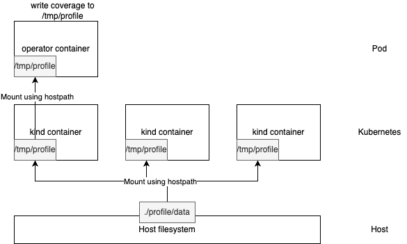

Google Drive Directory
https://drive.google.com/drive/folders/12XY6WmReuhvX2Du6KqB4xiFC3YEzRqMM

Google Sheet for list of operators in the wild
https://docs.google.com/spreadsheets/d/1_3-SlBRJO0Gtj6gt2Go1cOi4iRHdeBquoV-04Yel74A/edit?usp=sharing

Operator Porting Tracker
https://docs.google.com/spreadsheets/d/1qeMk4m8D8fgJdI61QJ67mBHZ9m3gCD-axcJB567z5FM/edit#gid=0

## Measure code coverage for Acto
Golang does not have many tools for measuring code coverage except the native `go test` util.
However, `go test` does not support measuring code coverage for E2E tests, it only supports 
measuring code coverage on unit/integration level.

We use a series of hacks to measure the code coverage for Acto:
On the high level, the steps are:
1. Compile the operator into a binary which outputs code coverage
2. Mount host's directory into the operator container's file system so that the code coverage file is directly
    written to the host's file system
3. Merge the coverage files into one file, and remove the coverage information on the generated code. Then compute the code coverage.

### Compile the operator into a binary which outputs code coverage
1. Create a new file called `main_test.go` under the same directory with the `main.go`, the `main_test.go` 
should contain one unittest which calls the `main` function. In this way, we created a virtual
unittest which just runs the `main` function, essentially an E2E test.
2. Next, we need to compile this unittest into a binary and build a docker image on it. Luckily, 
`go test` supports `-c` flag which compiles the unittest into a binary to be run later instead of 
running it immediately. We then modify the `Dockerfile` to change the build command from `go build ...`
to `go test -c ...` with approriate flags. Along with the build flags, we also pass in the test flags
such as `-coverpkg -cover`.
3. Having the test binary is not enough, we need to pass in a flag when running the binary to redirect 
the coverage information to a file. To do this, we need to create a shell script which exec the binary 
with the `-test.coverprofile=/tmp/profile/cass-operator-``date +%s%N``.out` flag and make this shell 
script the entrypoint of the docker image.

### Mount host's directory into the operator container's file system

The goal of this step is to let the operator binary we produce in the first step to be able to
    write directly to host's file system.
Because Pods in Kubernetes are disposable instances and their files are all deleted once they
    are deleted.
1. Change the Kind configuration file to mount a hostpath into each Kind node. E.g.:
```yaml
apiVersion: kind.x-k8s.io/v1alpha4
kind: Cluster
nodes:
- extraMounts:
  - containerPath: /tmp/profile
    hostPath: profile/data
  role: worker
```
2. Change the operator's deployment to mount the hostpath from Kind's into the operator container.
    Be careful with other parameters in the deployment yaml. E.g., make sure that the process has
    enough privilege to write to the directory. Also make sure the entrypoint of the operator
    container is not overwritten.
```yaml
      containers:
      - volumeMounts:
        - mountPath: /tmp/profile
          name: profile-dir
      volumes:
      - name: profile-dir
        hostPath:
          # directory location on host
          path: /tmp/profile
```

### Merge the coverage files into one file, and remove the coverage information on the generated code
This step is easy. 
After running all tests, just use the `gocovmerge` tool to merge all the coverage file into one file.
Make sure to not to include other packages other than operators' package, and remove the automatically
    generated code from the operator.
After all coverage files are merged, run `go tools cover` to print the coverage information.